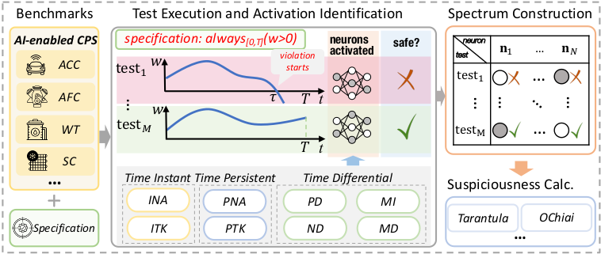

# TACTICAL: Fault Localization of AI-Enabled Cyber-Physical Systems by Exploiting Temporal Neuron Activation

This repository reports the code and the benchmarks for the paper *Fault Localization of AI-Enabled Cyber-Physical Systems by Exploiting Temporal Neuron Activation*.

## Abstract:

Modern *cyber-physical systems (CPS)* are evolving to integrate *deep neural networks (DNNs)* as controllers, leading to the emergence of *AI-enabled CPSs*. An inadequately trained DNN controller may produce incorrect control actions, exposing the system to safety risks. Therefore, it is crucial to localize the faulty neurons of the DNN controller responsible for the wrong decisions. However, since an unsafe system behavior typically arises from a sequence of control actions, establishing a connection between unsafe behaviors and faulty neurons is challenging. To address this problem, we propose TACTICAL that localizes faults in an AI-enabled CPS by exploiting *temporal neuron activation criteria* that capture temporal aspects of the DNN controller inferences. Specifically, based on testing results, for each neuron, TACTICAL constructs a *spectrum*, which considers the specification satisfaction and the evolution of the activation status of the neuron during the system execution. Then, starting from the spectra of all the neurons, TACTICAL applies suspiciousness metrics to compute a suspiciousness score for each neuron, from which the most suspicious ones are selected. We assess TACTICAL configured with eight *temporal neuron activation criteria*, on 3504 faulty AI-enabled CPS benchmarks spanning over different domains. The results show the effectiveness of TACTICAL w.r.t. a baseline approach.

